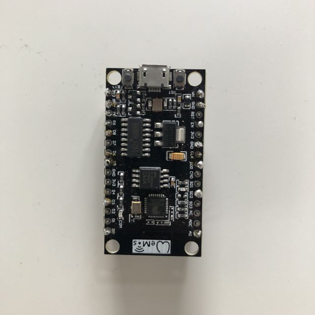
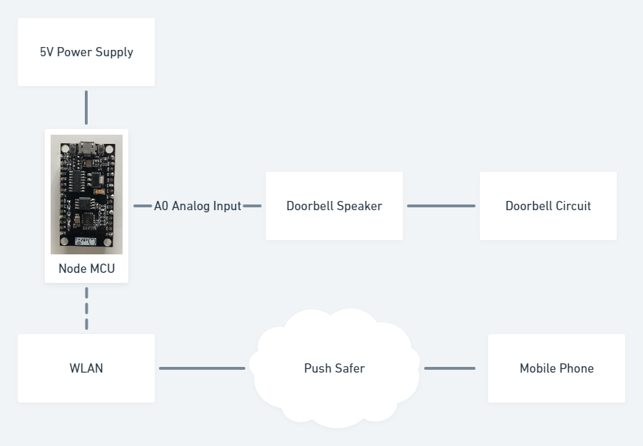

# NodeMCU-Doorbell-Notifier

## Problem Statement
While working from home due to Covid-19 pandemic, I started listening to music on noise cancelling headphones. This caused another problem. I couldn't hear the doorbell while I had my headphones on. 

## Requirement Listing
I started looking for methods to get notified via phone.  The system should be:
* able to recieve a signal from the doorbell circuit
* able to connect to my WLAN
* able to to send a notification to a server
* able to send notificaition from server to mobile app

I ended up buying a NodeMCU microcontroller since it was easily programmable like an Arduino.

##Solution

